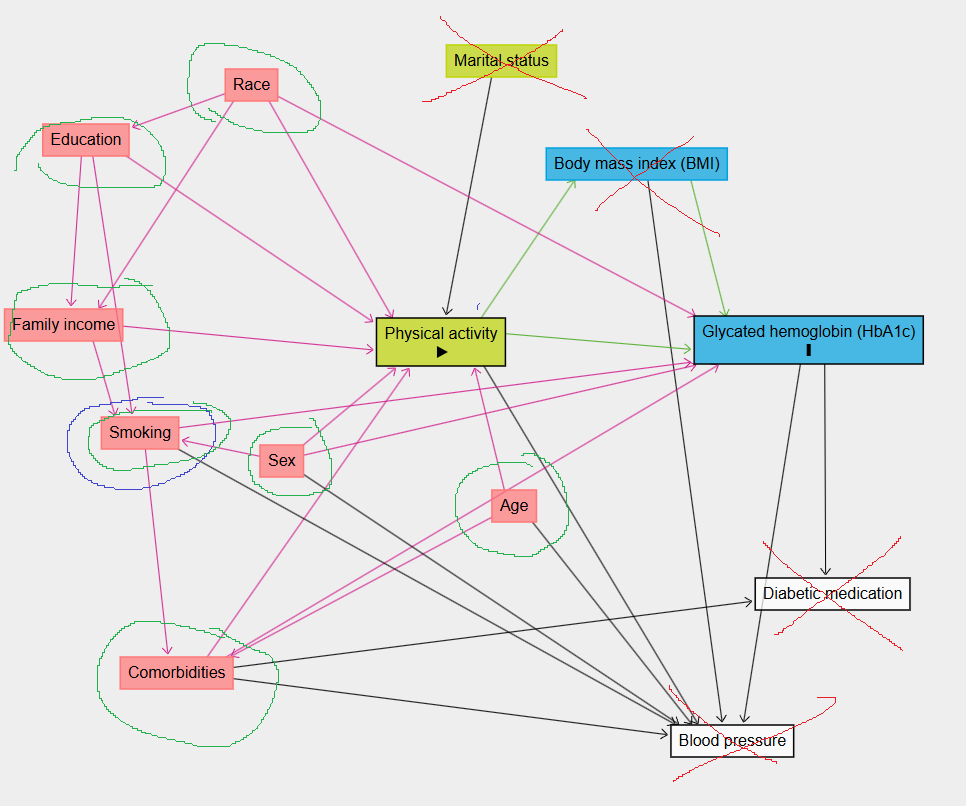

```{r setup, include=FALSE}
knitr::opts_chunk$set(echo = TRUE)
library(tidyverse)
library(summarytools)
library(rstatix)
library(GGally)
library(factoextra)
library(ggpubr)
library(ggbiplot)
library(tidymodels)
library(skimr)
library(corrplot)
library(gtsummary)
library(modelsummary)
library(broom)
library(ggfortify)
library(ggResidpanel)
library(performance)
library(lmtest)
library(sandwich)
```

# Data Import

```{r}
data <- read_tsv("HW_data.tsv")
```

```{r}
#summary(data)
```

# Task 1

Каким образом вы будете оценивать физическую активность респондентов?
Есть ли у вас предварительные предположения относительно того, каким
образом выбранный вами пока- затель может быть ассоциирован с
гликированным гемоглобином?

Для оценки физической активности воспользуемся шкалой MET -
<https://media.hypersites.com/clients/1235/filemanager/MHC/METs.pdf>
[верх первой страницы] С учётом того, что использование велосипеда будет
приравниваться к Moderate Activities.

Моя шкала активности будет Total_MET_minutes_per_week

По сути для кажого вида активности расчёт будет следующим: [коэф
активности] \* [есть ли это активность, пр. PAQ605] \* [дней в неделю с
такой активностью] \* [кол-во минут в день такой активности (конечно, в
те дни, когда сама активность была)]

```{r}
data_MET = data %>%
    mutate(
      # Define MET values for each activity type
      MET_vigorous_work = 8 * PAQ605 * PAD615 * PAQ610,
      MET_moderate_work = 4 * PAQ620 * PAD630 * PAQ625,
      MET_walk_bike = 4 * PAQ635 * PAD645 * PAQ640,
      MET_vigorous_recreation = 8 * PAQ650 * PAD660 * PAQ655,
      MET_moderate_recreation = 4 * PAQ665 * PAD675 * PAQ670,
      MET_sedentary = 1.5 * PAD680,
      
      # Calculate total MET-minutes per week
      Total_MET_minutes_per_week = MET_vigorous_work +
                                   MET_moderate_work +
                                   MET_walk_bike +
                                   MET_vigorous_recreation +
                                   MET_moderate_recreation -
                                   MET_sedentary
    )
```

## Отбор колонок для EDA

SEQN, RIAGENDR, RIDAGEYR, RIDRETH3, DMDEDUC2 [educational], INDFMIN2
[income], SMQ040 [smoking], LBXGH - Glycohemoglobin (%) [hemoglobin]

Comorbodities - посчитаем как есть/нет по всем колонкам BPQ

```{r}
data_MET_pre_final = data_MET %>% 
    mutate(Comorbidities = if_else(
        MCQ010 == 1 | MCQ035 == 1 | MCQ160C == 1 | MCQ160B == 1 |
        MCQ160E == 1 | MCQ160F == 1 | MCQ160M == 1 | MCQ170M == 1 |
        MCQ160O == 1 | MCQ220 == 1,
        1, 0)) %>%
    select(SEQN, RIAGENDR, RIDAGEYR, RIDRETH3, DMDEDUC2, INDFMIN2, SMQ040, 
           LBXGH, Comorbidities, Total_MET_minutes_per_week)
```

Factors: RIAGENDR, RIDRETH3, DMDEDUC2, INDFMIN2, Comorbidities, SMQ040
Numeric: LBXGH, Total_MET_minutes_per_week

Привем факторы и поменяем значения на именные. На всякий случай гликолиз
к численному типу приведем.

```{r}
data_MET_final = data_MET_pre_final %>% mutate(
    Gender = factor(RIAGENDR, levels = c(1, 2),
                    labels = c("Male", "Female")),
    Race = factor(RIDRETH3,  levels = c(1, 2, 3, 4, 6, 7),
                       labels = c("Mexican American",
                                  "Other Hispanic",
                                  "White",
                                  "Black",
                                  "Asian",
                                  "Other Race")),
    Education = factor(DMDEDUC2, levels = c(1, 2, 3, 4, 5),
                       labels = c("< 9th grade",
                                  "9-11th grade",
                                  "High School",
                                  "College UnderGrad",
                                  "College Grad")),
    Income_Level = factor(INDFMIN2,
                         levels = 1:12,
                         labels = c(
                           "Up to 4,999$",
                           "5k-9,999$",
                           "10k-14,999$",
                           "15k-19,999$",
                           "20k-24,999$",
                           "25k-34,999$",
                           "35k-44,999$",
                           "45k-54,999$",
                           "55k-64,999$",
                           "65k-74,999$",
                           "75k-99,999$",
                           "100k+"
                         )),
    Comorbidities = factor(Comorbidities, levels = c(0, 1),
                           labels = c("No", "Yes")),
    Smoking = factor(SMQ040, levels = 1:3,
                     labels = c("EveryDay", "SomeDay", "Not at all")),
    GlyHemo = as.numeric(LBXGH)) %>%
  select(Gender, Race, Education, Income_Level, Comorbidities,
         Smoking, GlyHemo, Total_MET_minutes_per_week)
```

```{r}
head(data_MET_final)
```

# Task 3

Проведите необходимый эксплораторный анализ перед оценкой модели.

Здесь начнём с 3-го пункта, чтобы посмотреть на наши данные, а потом пойдем модель делать :)

```{r, fig.height=7, fig.width=8, figure.dpi=200}
numeric_cols <- select_if(data_MET_final, is.numeric)
factor_cols <- select_if(data_MET_final, is.factor)
```

```{r}
tbl_summary(
  data_MET_final, 
  type = list(all_continuous() ~ "continuous2"),
  statistic = list(
    all_continuous() ~ c("{mean} ({sd})", "{median} ({p25}-{p75})", "{min}-{max}")
  )) %>%
  modify_footnote(everything() ~ NA) %>%
  bold_labels()
```

```{r, fig.height=5, fig.width=5, figure.dpi=200}
factor_cols %>%
  gather(key = "Variable", value = "Value") %>%
  ggplot(aes(x = Value)) +
  geom_bar(fill = "steelblue") +
  facet_wrap(~ Variable, scales = "free") +
  theme_minimal() +
  theme(
    axis.text.x = element_text(angle = 90, hjust = 1)
  )
```

По факторным колонкам видим следующее:\
1. У нас чуть больше Мужчин, чем Женщин\
2. В выборке преобладает "Белое" население США\
3. В выборке преобладают люди с высоким годовым заработком: >100k$ - соответсвенно мы работаем с зажиточным населением в большинстве своём. 

```{r, fig.height=7, fig.width=8, figure.dpi=200}
numeric_cols %>%
  gather(key = "Variable", value = "Value") %>%
  ggplot(aes(x = Value)) +
  geom_histogram(bins = 30, fill = "steelblue", color = "black") +
  facet_wrap(~ Variable, scales = "free") +
  theme_minimal()
```
Видим, что у нас есть "выбросы" и по GlyHemo и по Total_MET_minutes_per_week. Например, у нас есть много аутлайеров по кол-во гликолизированного гемоглобина (GlyHemo = 0) - возможно это связано с очень крутыми спорстменами и/или специфичным метаболизмом какой-нибудь группы людей (e.g. по профессии и т.п.).\

Все-таки отфильтруем выбросы используя 1.5 IQR метод для обоих колонок, чтобы они нам не мешали оценивать средний эффект:

```{r}
data_MET_final <- data_MET_final %>% 
  filter(GlyHemo < quantile(GlyHemo, 0.75, na.rm = TRUE) + 1.5 * IQR(GlyHemo, na.rm = TRUE) &
         GlyHemo > quantile(GlyHemo, 0.25, na.rm = TRUE) - 1.5 * IQR(GlyHemo, na.rm = TRUE),
         Total_MET_minutes_per_week < quantile(Total_MET_minutes_per_week, 0.75, na.rm = TRUE) + 1.5 * IQR(Total_MET_minutes_per_week, na.rm = TRUE) &
         Total_MET_minutes_per_week > quantile(Total_MET_minutes_per_week, 0.25, na.rm = TRUE) - 1.5 * IQR(Total_MET_minutes_per_week, na.rm = TRUE)
          )

numeric_cols <- select_if(data_MET_final, is.numeric)
```

Вычистили аутлайеры, посмотрим на распределения ещё раз:
```{r, fig.height=7, fig.width=8, figure.dpi=200}
numeric_cols %>%
  gather(key = "Variable", value = "Value") %>%
  ggplot(aes(x = Value)) +
  geom_histogram(bins = 30, fill = "steelblue", color = "black") +
  facet_wrap(~ Variable, scales = "free") +
  theme_minimal()
```
Видим, что все-таки физическая активность у нас имеет не очень нормальное распределение, а более негативно-биномиальное-эспоненциальное. Давайте прологарифмируем эту метрику и посмотрим ещё раз. Правда, т.к. у нас есть отрицательные значения, то нам понадобится log1p + offset шкалирование. И отфильтруем данные от супер изначально отрицательных значений.

```{r}
data_MET_final <- data_MET_final %>% 
  mutate(Total_MET_minutes_per_week_log = log1p(Total_MET_minutes_per_week 
                                                + abs(min(Total_MET_minutes_per_week)))
          ) %>%
  filter(Total_MET_minutes_per_week_log > 2.5)

numeric_cols <- select_if(data_MET_final, is.numeric)
```

```{r, fig.height=7, fig.width=8, figure.dpi=200}
numeric_cols %>%
  gather(key = "Variable", value = "Value") %>%
  ggplot(aes(x = Value)) +
  geom_histogram(bins = 30, fill = "steelblue", color = "black") +
  facet_wrap(~ Variable, scales = "free") +
  theme_minimal()
```
Нас интересуют средний и правый графики. Видим, что распределение физической активности стало гораздо лучше. Дальше в модели будем использовать иммено логарифм.


```{r, fig.height=7, fig.width=8, figure.dpi=200}
# Correlation matrix
cor_matrix <- cor(numeric_cols, use = "complete.obs")

# Visualize correlation matrix
library(corrplot)
corrplot(cor_matrix, method = "color", type = "upper", tl.col = "black", tl.cex = 0.8)
```
"В лоб" наши exposure (и в логарифме и без) & outcome не особо коррелируют между собой. Интересно, что покажет анализ лин. регрессий.

Боксплоты на числовых колонок:
```{r, fig.height=4, fig.width=4, figure.dpi=200}
# Boxplot to identify outliers
numeric_cols %>%
  gather(key = "Variable", value = "Value") %>%
  ggplot(aes(y = Value)) +
  geom_boxplot(fill = "steelblue") +
  facet_wrap(~ Variable, scales = "free") +
  theme_minimal()

# Calculate Z-scores
numeric_cols %>%
  mutate_all(~ (.-mean(.)) / sd(.)) %>%
  filter_if(is.numeric, any_vars(abs(.) > 3))
```
```{r, fig.height=4, fig.width=4, figure.dpi=200}
# Boxplot to identify outliers
data_MET_final %>%
  ggplot(aes(y = GlyHemo, x=Gender)) +
  geom_boxplot(fill = "steelblue") +
  theme_minimal()
```

# Task 2

Ковариаты для каких показателей вы включите в модель для коррекции эффекта физической
активности в отношении гликированного гемоглобина? Каким образом вы будете их оцени-
вать по имеющимся данным?



Прошу прощения за такую "красивую" визуализацию. Суть здесь такая: зеленым обведены колонки, которые мы возьмём с собой в модель, т.к. это конфаундеры и необходимы нам для корректного нахождения "total effect". Красным перечеркнуты факторы, которые нам не нужны - это либо медиаторы (BMI), либо коллайдеры (Blood Pressure, Diabetes), либо что-то просто не нужное (Marital Status).

Вопрос вызывает только одна вещь - Курение!
Отсутствие стрелки в ДАГе является сильным заявлением отсутствия связи. На мой взгляд, курение не только связано с другими факторами, пр. comorbidities, но и должно быть напрямую связано с Physical Activity. Как курящий человек, могу сказать, что курильщикам сложнее зачастую заниматься спортом, т.к. отдышка и т.д., курильщикам больше нужно времени на восстановление после физических активностей.

Т.о. субъективно пришёл к выводу, что курение нужно оставить в модели, хоть в изначальном ДАГе причин для его включения не особо есть.


# Task 4
Оцените модель для зависимости гликированного гемоглобина от выбранного вами показа-
теля физической активности без ковариат и с ними. Проведите необходимую диагностику
этих моделей -- требует ли что-либо коррекции и почему? В случае необходимости коррек-
ции по результатам диагностики сделайте ее.

## Модель без дополнительных эффектов

```{r}
formula_1 = formula(GlyHemo ~ Total_MET_minutes_per_week_log)

model.matrix(formula_1, data_MET_final) %>% 
  head()
```
```{r}
first_fit <- lm(formula_1, data_MET_final)
print(first_fit)
```

```{r}
summary(first_fit)
```

```{r}
broom::tidy(first_fit, conf.int = TRUE)
```
Как видим, модель без эффектов ничего не видит. Коэффициент перед нашим exposure около-нулевой и не стат. значимый.

## Модель с дополнительными эффектами

```{r}
formula_all = formula(GlyHemo ~ Total_MET_minutes_per_week_log + Smoking + 
                        Education + Comorbidities + 
          Income_Level + Education + Race + Gender)
```

```{r}
all_fit <- lm(formula_all, data_MET_final)
print(all_fit)
```

```{r}
summary(all_fit)
```

```{r}
broom::tidy(all_fit, conf.int = TRUE)
```
```{r}
broom::augment(all_fit) %>% head()
```
## Диагностика модели
```{r}
autoplot(all_fit)
```
Вообще по диагностике все выглядит хорошо. Меня только смущает "сетчатая" структура на графике Scale-Location. Это очень странно, конечно.


# Task 5 & 6
Представьте результаты оценки модели без ковариат и с ковариатами в виде точечной и интервальной оценки эффекта физической активности. Дайте им словесную интерпретацию. Какие выводы мы можем сделать, исходя из точечной оценки? А из интервальной? Как вы думаете, можно ли считать эффект клинически значимым? Если затрудняетесь с ответом, что бы вам помогло дать ответ на этот вопрос?

Сокращенная модель:
```{r}
summary(first_fit, conf.int = TRUE)
broom::tidy(first_fit, conf.int = TRUE)
```
Что имеем здесь: coef= -0.48 +- 0.4, p = 0.019

Полная модель:
```{r}
summary(all_fit, conf.int = TRUE)
broom::tidy(all_fit, conf.int = TRUE)
```
Что имеем здесь: coef= -0.37 +- 0.4, p = 0.07

Т.о. точечная оценка коэффициента в обоих случаях была отрицательной, но в полной модели интервальная оценка пересекла 0, поэтому в полной модели у нас нет стат. значимости (alpha = 0.05) для ассоциации между физической активностью и кол-вом гликолизированного гемоглобина.

Интепретация: Из биологии было ожидаемо, что физическая активность связана с пониженным уровнем гликолизированного гемоглобина. В облегченной модели мы получили именно такой эффект, причём стат. значимый. Однако в полной модели мы потеряли стат. значимость.

Иными словами, из точечной оценки мы бы могли сделать сильные выводы, что вот физ. активность ассоциирована с пониженным уровнем гликолизированого гемоглобина, однако интервальная оценка корректирует такие сильные выводы, показывая что точечные оценки должны рассматриваться аккуратно.

# Task 7

Является ли пол модификатором эффекта физической активности в отношении гликирован- ного гемоглобина? Если да, каков эффект для мужчин и женщин и насколько он отличается между ними?

Чтобы проверить это, давайте сконструируем простую лин. модель с взаимодействием факторов. 
```{r}
formula_gender = formula(GlyHemo ~ Total_MET_minutes_per_week_log*Gender)

model.matrix(formula_gender, data_MET_final) %>% 
  head()
```

```{r}
gender_fit <- lm(formula_gender, data_MET_final)
```

```{r}
summary(gender_fit, conf.int = TRUE)
broom::tidy(gender_fit, conf.int = TRUE)
```

Что мы видим: коэффициент ассоциации для мужчин (-0.08), в то же время как для женщин коэффициент ассоциации (-0.77). Такая сильная разница для полов показывает (учитывая, что коэффициент без модификации у нас был -0.38), что с одной стороны по всей видимости у женщин физическая нагрузка сильнее снижает уровень Hb1Ac, с другой стороны ни один из коэффициентов не является стат. значимым, поэтому мы можем только отметить тренд.

Еще одно наблюдение: коэф. перед фактором "GenderFemale" является положительным и показывает, что средний уровень Hb1Ac у женщин выше, чем у мужчин, причём стат. значимо!

# Task 8
Соответствуют ли полученные вами результаты вашему исходному предположению? Как меняется оценка эффекта физической активности при добавлении ковариат в модель и почему?

Ответ на первый вопрос: Да, соответствует. Везде получили, что Hb1Ac отрицательно связан с физ. нагрузкой, что ожидалось из изучения литературы.
Ответ на второй вопрос: Оценка силы коэф. total-effect снизилась при добавлении ковариат (конфаундеров). Как понимаю, это закономерный результат, т.к. часть "ассоциации" между outcome и exposure забрали на себя как раз конфаундеры, объяснив собой какие-то девиации уровня Hb1Ac от среднего. Такие дела.

# Бонусное задание
Бонусное задание: оцените прямой (direct) эффект физической активности на гликирован- ный гемоглобин (со всей необходимой диагностикой и коррекциями). Как он отличается от общего (total) эффекта? В чем причина/ механизм этих различий?

Давайте включим медиатор в наше исследование, чтобы посмотреть на direct effect.
В нашем случае, у нас только один медиатор BMI.

Страшная монолитная ячейка с подготовкой данных:
```{r}
data_MET_final_bonus = data_MET %>% 
    mutate(Comorbidities = if_else(
        MCQ010 == 1 | MCQ035 == 1 | MCQ160C == 1 | MCQ160B == 1 |
        MCQ160E == 1 | MCQ160F == 1 | MCQ160M == 1 | MCQ170M == 1 |
        MCQ160O == 1 | MCQ220 == 1,
        1, 0)) %>% mutate(
    Gender = factor(RIAGENDR, levels = c(1, 2),
                    labels = c("Male", "Female")),
    Race = factor(RIDRETH3,  levels = c(1, 2, 3, 4, 6, 7),
                       labels = c("Mexican American",
                                  "Other Hispanic",
                                  "White",
                                  "Black",
                                  "Asian",
                                  "Other Race")),
    Education = factor(DMDEDUC2, levels = c(1, 2, 3, 4, 5),
                       labels = c("< 9th grade",
                                  "9-11th grade",
                                  "High School",
                                  "College UnderGrad",
                                  "College Grad")),
    Income_Level = factor(INDFMIN2,
                         levels = 1:12,
                         labels = c(
                           "Up to 4,999$",
                           "5k-9,999$",
                           "10k-14,999$",
                           "15k-19,999$",
                           "20k-24,999$",
                           "25k-34,999$",
                           "35k-44,999$",
                           "45k-54,999$",
                           "55k-64,999$",
                           "65k-74,999$",
                           "75k-99,999$",
                           "100k+"
                         )),
    Comorbidities = factor(Comorbidities, levels = c(0, 1),
                           labels = c("No", "Yes")),
    Smoking = factor(SMQ040, levels = 1:3,
                     labels = c("EveryDay", "SomeDay", "Not at all")),
    GlyHemo = as.numeric(LBXGH),
    BMI = as.numeric(BMXBMI)) %>%
  select(Gender, Race, Education, Income_Level, Comorbidities,
         Smoking, GlyHemo, Total_MET_minutes_per_week, BMI) %>% 
          filter(GlyHemo < quantile(GlyHemo, 0.75, na.rm = TRUE) + 1.5 * IQR(GlyHemo, na.rm = TRUE) &
                 GlyHemo > quantile(GlyHemo, 0.25, na.rm = TRUE) - 1.5 * IQR(GlyHemo, na.rm = TRUE),
                 Total_MET_minutes_per_week < quantile(Total_MET_minutes_per_week, 0.75, na.rm = TRUE) + 1.5 * IQR(Total_MET_minutes_per_week, na.rm = TRUE) &
                 Total_MET_minutes_per_week > quantile(Total_MET_minutes_per_week, 0.25, na.rm = TRUE) - 1.5 * IQR(Total_MET_minutes_per_week, na.rm = TRUE)
                  ) %>% 
  mutate(Total_MET_minutes_per_week_log = log1p(Total_MET_minutes_per_week 
                                                + abs(min(Total_MET_minutes_per_week)))
          ) %>%
  filter(Total_MET_minutes_per_week_log > 2.5)
```

Обучаем модель:
```{r}
formula_bonus = formula(GlyHemo ~ Total_MET_minutes_per_week_log + Smoking + 
                        Education + Comorbidities + 
          Income_Level + Education + Race + Gender + BMI)
```

```{r}
bonus_fit <- lm(formula_bonus, data_MET_final_bonus)
```

```{r}
broom::tidy(bonus_fit, conf.int = TRUE)
```

Что видим: коэф. перед Total_MET_minutes_per_week_log стал ещё меньше. Почему? Если правильно понимаю, опять же, все из-за того, что медиатор "съел" часть связи между Физ.активностью и Hb1Ac. Поэтому мы не получил total effect, а direct effect, i.e. не весь эффект от exposure, а только прямой на наш outcome.


